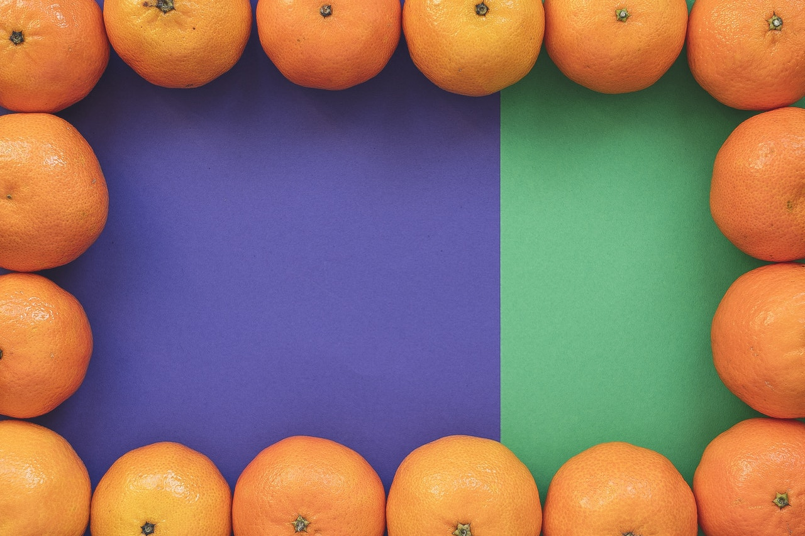
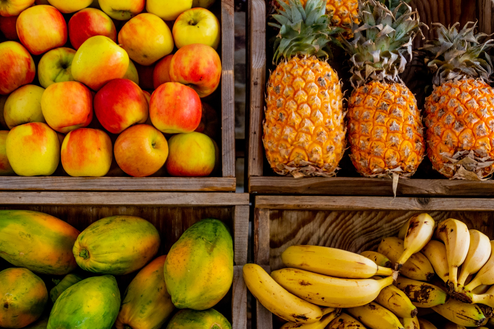

**This is post 3**

import { useState } from "react"

export const Button = () => {
  const [count, setCount] = useState(100)
  return (
    <button onClick={() => setCount(count + 10)}>Count is - {count}</button>
  )
}

<Button />

```js
const x = 199
```

```html
<body></body>
```

```javascript
// In your gatsby-config.js
plugins: [
  {
    resolve: `gatsby-transformer-remark`,
    options: {
      plugins: [`gatsby-remark-prismjs`],
    },
  },
]
```





